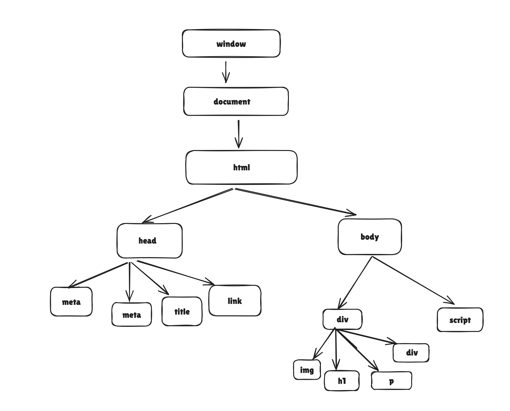

# JavascriptBasics

Going to learn and commit sample codes to understand Javascript Basics 

Topic 1 : DOM(Document Object Model)

writing index.js as a seperate javascript benefits are below
1. readability
2. Modularity
3. Easy for code review and modification of code
4. Browser Caching

Window Object:- The window object represents an open window in a browser. It is browser's object (not Javascript's ) & is automatically created by browser.

It is a global object with lots of properties and methods.

No need to write window specifically. Javascript already aware of window to pick up from that. Window is the root object of all the functions inside the javascript to use.

What is DOM(Document Object Model)
When a webpage is loaded, the browser creates a Document Object Model (DOM) of the page.

What ever we write as a HTML page all the elements(tags) of HTML can be accessed through Javascript. Each element of HTML is converted in Javascript as Object and that special object which is converted in javascript is called as Document .

This Document is available inside the Window object(which is root object of all in Javascript).

